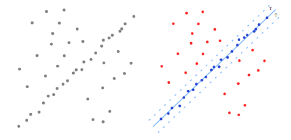

# robustEstimation

Performing model estimation is not an easy task, data are always corrupted by noise and "false/outlier" data so robust estimation is required to find the "best" model along the possible ones.



This project provides many methods to estimate one of the best possible model in corrupted data:

- Max-Consensus,
- Ransac,
- LMeds,
- AC-Ransac (A Contrario Ransac).


## Max-Consensus

The idea of Max-Consensus is to use a random picked subset of data to find a model and test if
this model is good or not the whole dataset. At the end you keep the model that best fits your cost
function. Best fit defined as the number of data correspondences to the model under your specified
threshold T.

Algorithm 1 Max-Consensus

```
Require: correspondences
Require: model solver, residual error computation
Require: T threshold for inlier/outlier discrimination
Require: maxIter the number of performed model estimation
Ensure: inlier list
Ensure: best estimated model Mbest
	for i = 0 ! maxIter do
		Pick NSample random samples
		Evaluate the model Mi for the random samples
		Compute residuals for the estimated model
		if Cardinal(residual < T) > previousInlierCount then
			previousInlierCount = Cardinal(residual < T)
			Mbest = Mi
		end if
	end for
```
	
Here an example of how find a best fit line:

```
Mat2X xy ( 2 , 5);
// Defines some data points
xy << 1, 2, 3, 4,  5, // x
      3, 5, 7, 9, 11; // y

// The base model estimator and associated error metric
LineKernel kernel ( xy );

// Call the Max-Consensus routine
std::vector<size_t> vec_inliers;
Vec2 model = MaxConsensus ( kernel , ScorerEvaluator<LineKernel >(0.3) , &-vec_inliers );
```


## Ransac

Ransac [RANSAC] is an evolution of Max-Consensus with a-priori information about the noise and corrupted
data amount of the data. That information allows to reduce the number of iterations in order to be
sure to have made sufficient random sampling steps in order to find the model for the given data
confidence. The number of remaining steps is so iteratively updated given the inlier/outlier ratio of
the current found model.

Here an example of how find a best fit line:

```
Mat2X xy ( 2 , 5);
// Defines some data points
xy << 1, 2, 3, 4,  5, // x
      3, 5, 7, 9, 11; // y
			
// The base model estimator and associated error metric
LineKernel kernel ( xy );

// Call the Ransac routine
std::vector<size_t> vec_inliers;
Vec2 model = Ransac ( kernel, ScorerEvaluator<LineKernel >(0.3) , &vec_inliers );
```

	
## AC-Ransac A Contrario Ransac

RANSAC requires the choice of a threshold T, which must be balanced:

- Too small: Too few inliers, leading to model imprecision,
- Too large: Models are contaminated by outliers (false data).

AC-Ransac [ACRANSAC] uses the a contrario methodology in order to find a model that best fits the
data with a confidence threshold T that adapts automatically to noise. It so finds a model and its
associated noise. If there is too much noise, the a contrario method returns that no model was
found.


Here an example of how to find a best fitting line, by using the a contrario robust estimation framework:
It is a bit more complex, we use a class in order to perform the a contrario required task.

```
Mat2X xy ( 2 , 5);
// Defines some data points
xy << 1, 2, 3, 4,  5, // x
      3, 5, 7, 9, 11; // y
			
// The acontrario adapted base model estimator and associated error metric
const size_t img_width = 12;
ACRANSACOneViewKernel<LineSolver, pointToLineError, Vec2> lineKernel(xy,  -img_width, img_width);

// Call the AC-Ransac routine
std::vector<size_t> vec_inliers;
Vec2 line;
std::pair<double, double> res = ACRANSAC(lineKernel, vec_inliers, 300, &line);
double dPrecision = res.first;
double dNfa = res.second;
```
